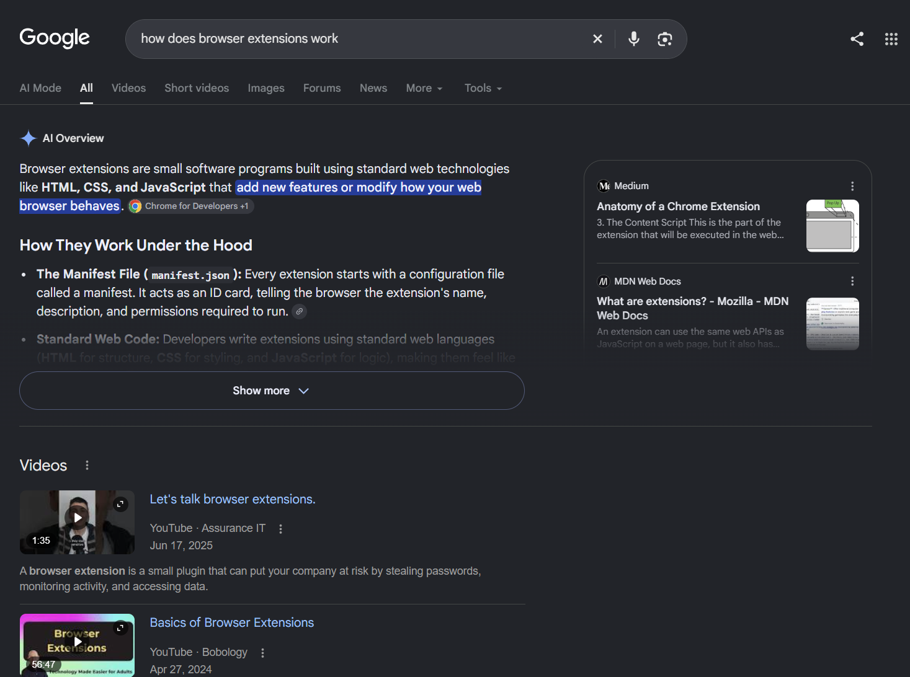
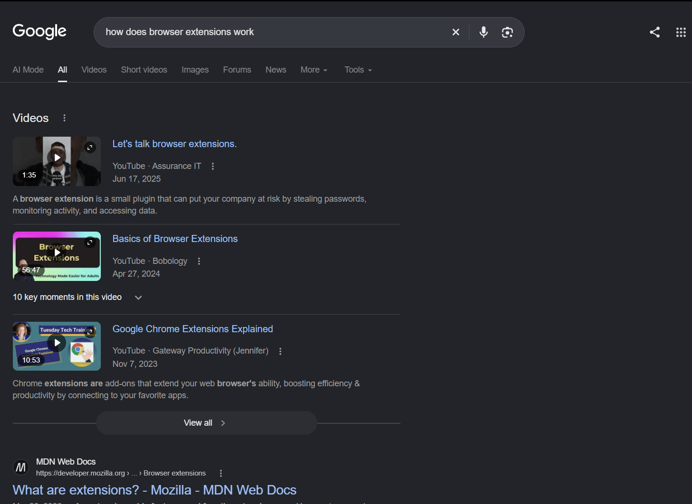
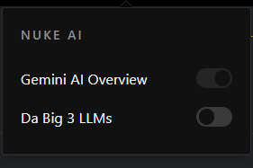

# Nuke AI

**Nuke AI** is a Chrome extension that takes back your search experience. It removes Google's AI Overview from your search results, and it can send your questions to a regular search engine instead of an AI chatbot. Each feature has its own switch, so you decide what gets nuked.

Search the web, read the sources, and make up your own mind.

## Preview

<!-- Uncomment each line after you upload the image to the assets folder -->
 **Before**
 

**After**
 

**UI Overview**
  

## Features

### Nuke AI Overview
Google's AI-generated answer box is removed from the results page before you ever have to scroll past it. You get the plain list of links, nothing in between.

*On by default.*

### Nuke LLM Redirect
When you write a prompt in **Gemini**, **Claude** or **ChatGPT** and press Enter (or click the send button), the extension intercepts it and opens the same query as a web search on [Exa](https://exa.ai) instead. Useful when you realize you'd rather read real sources than a generated answer.

*Off by default.* Turn it on when you want it.

## Installation

The extension isn't on the Chrome Web Store, so you load it yourself. It takes about a minute.

1. **Clone the repository**

   ```bash
   git clone https://github.com/KritamKhatiwada/nukeai.git
   ```

2. **Open the extensions page** in Chrome by going to `chrome://extensions`.

3. **Turn on Developer mode** using the toggle in the top-right corner.

4. **Click "Load unpacked"** and select the cloned folder (the one that contains `manifest.json`).

5. **Pin the extension** from the puzzle-piece menu so it's easy to reach.

That's it. If you pull new changes later, go back to `chrome://extensions` and click the reload icon on the extension.

## Usage

1. Click the extension icon to open its settings.
2. Switch **Nuke AI Overview** and **Nuke LLM Redirect** on or off.
3. Reload any open Google, Gemini, Claude or ChatGPT tab for the change to apply.

Your choices are saved with `chrome.storage.local`, so they stay the same between browser sessions and never leave your computer.

## Good to Know

* Both features rely on the page layout of Google, Gemini, Claude and ChatGPT. If one of those sites changes its design, a feature may stop working until the selectors in the content script are updated.
* The redirect watches the prompt box and the send button on each supported site. Supported sites are listed in the `aiList` array in the content script, so adding another one only takes a new entry with its name, send button selector and prompt box selector.
* No data is collected or sent anywhere, apart from the query that you choose to redirect to Exa.

## Customizing

Want to redirect to a different search engine? Change the URL in the content script (`https://exa.ai/search?q=`) to any search URL that takes a query string.
